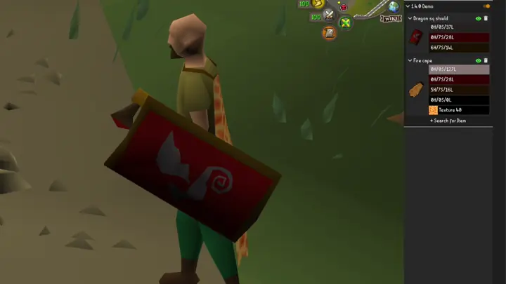
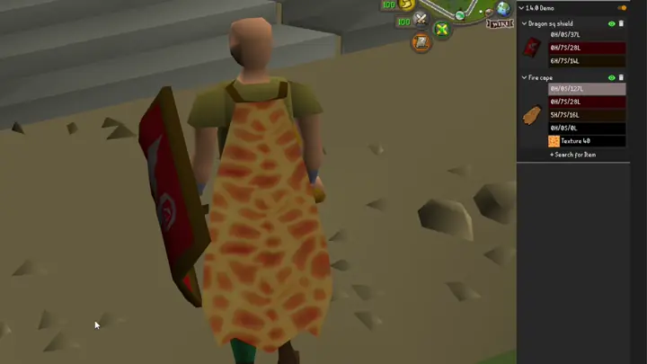
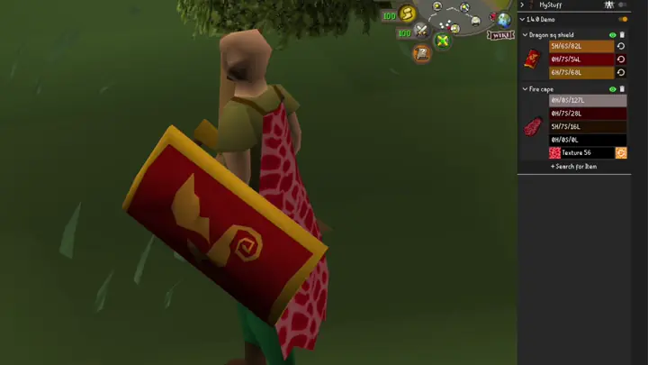
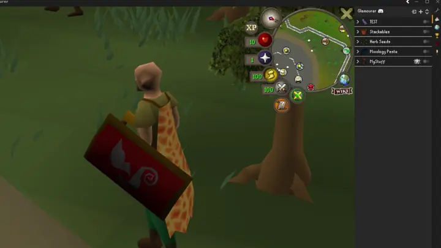

#  Glamourer

The RuneLite plugin for changing appearances of Old School RuneScape items (and pets!).
Customize the colors of nearly any item for fashion, accessibility, or just because you feel like it.

Unlike similar recoloring plugins that just overlay an image on top of the item's default icon, Glamourer modifies the
item composition at a deeper level which changes items in your inventory, equipment, and everywhere else it is visible.

Join [Discord](https://discord.gg/B6dD9R5U36) to share your creations, get technical support, and chat with others.

## Features

- **Item Recoloring**: Change the colors of any item in the game and see it in your inventory, equipment, on the ground, etc.
- **Texture Replacing**: Change the texture of any textured item (e.g. fire cape, infernal cape) with any other game texture
- **Pet Glamours**: If you glamour a pet item, it will apply to your follower and your menagerie pets
- **Glamour Plates**: Organize multiple item recolors into glamour plates that can be enabled/disabled together
- **Display Style**: Choose whether a glamours appear only on yourself or also on other players
- **Color Groups**: Similar colors on an item are automatically grouped, allowing batch editing with a single picker
- **Import/Export**: Share plates with your friends by importing and exporting JSON
- **Party Sync**: Synchronize your (and your pet's) appearance with your party members

## Usage

Install Glamourer from the RuneLite plugin hub. To use Glamourer, open the panel from the RuneLite sidebar ().

### Make your own glamours
1. Press the "**+**" button at the top right to create a new, empty plate
1. Press "**+ Search for Item**" to search for and add items to your plate
1. Click on a color swatch to open the color picker
1. When you press "OK", the new color will immediately apply to the item's icon and your equipment

> [!NOTE]
> Some colors are only used by the inventory icon or by the equipment and not both.
> There is no indicator if the color is only used by one or the other.
> Your edit may change the icon and not your equipped item or vice versa.

### HSL Picker
Runescape uses "Jagex" color instead of more standard formats like RGB. Jagex color is a variant of HSL (Hue, Saturation, Luminance). The "HSL" value in the color picker represents a unique color. The "Hue", "Sat", "Lum" sliders change individual components of the full HSL.

When you open the color picker, the HSL textbox is automatically selected. If you want to copy/paste colors, you can press **ctrl+c** or  to copy or **ctrl+v** to paste.

On the left side of the picker are the following:
1. Current color preview
2. Previous color - what you opened the picker with
3. Original color - what color the item had before edits

On the right side of the picker are the following:
1. **Hue** - the chromatic component. Think of this as a "color wheel."
2. **Sat** - the color intensity. Low values have less color (more black & white), high values have more color.
3. **Lum** - The color brightness. Low values are darker, high values are lighter.

> [!NOTE]
> The color preview shows a "shaded gradient" which simulates what the color looks like in-game at various lighting levels.
> The "mode" in the lower left changes this style.

### Import from JSON
1. Click the Import button () to open the import **dialog**
1. Copy JSON from somewhere, such as the Glamourer Discord server
1. Right click paste or ctrl+v into the textbox
1. Press import
   * If you have already imported the plate before, you can choose to overwrite the existing plate instead

### Change the way other people look
By default, glamours only affect your character and not other people. If you want to change the way an item looks for
everyone, right-click the plate header and press " Show on everyone."

If your glamours are affecting everyone and you want to undo it, right-click the plate header and press " Show on self only."

### Party Sync
* The first time you join a party, a dialog will appear asking if you want to enable Party Sync.
   * If you want to change this setting later check the Glamourer settings or party sync panel
* If you agree to sync, your appearance will be shared with your party members, and theirs will be shared with you.
* Toggle open the party sync panel ( button in the Glamourer UI) to hide/unhide specific party members.
* If you're using [Weapon Animation Replacer](https://runelite.net/plugin-hub/show/weapon-animation-replacer), you can enable Party Share in its settings to also share its changes with your party members.
   * This plugin requires clicking its "Update Transmog" button to synchronize changes with your party members.
   * After clicking "Update Transmog", open the Glamourer party panel and click  to resync glamours.

## Examples

### Recolor

### Retexture

### JSON Export / Import

## Contributing

I am open for small contributions. I will likely reject large contributions; reach out to discuss what you want before changing anything.

## Known Issues
* Recoloring herb seeds does not work properly.
  * I have opened an issue on RuneLite to fix: https://github.com/runelite/runelite/issues/19913
  * No workaround