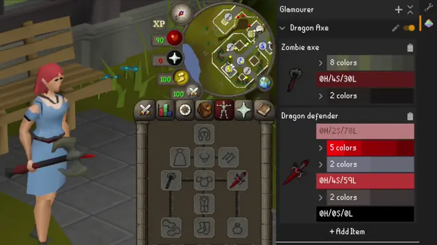
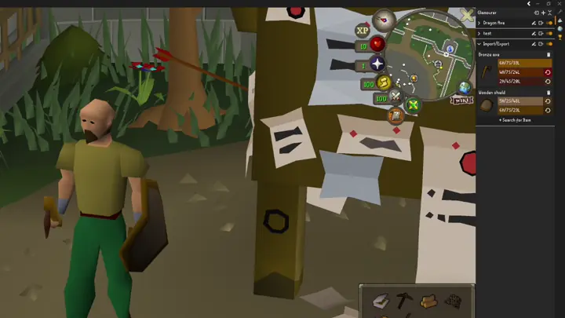

# Glamourer

The RuneLite plugin for changing appearances of Old School RuneScape items. Customize the colors of nearly any item for
fashion, accessibility, or just because you feel like it.

Unlike similar recoloring plugins that just overlay an image on top of the item's default icon, Glamourer modifies the
item composition at a deeper level which changes items in your inventory, equipment, and everywhere else it is visible.

## Features

- **Item Recoloring**: Change the colors of any item in the game and see it in your inventory, equipment, on the ground, etc.
- **Glamour Plates**: Organize multiple item recolors into glamour plates that can be enabled/disabled together
- **Color Groups**: Similar colors on an item are automatically grouped, allowing batch editing with a single picker
- **Import/Export**: Share plates with your friends by importing and exporting JSON

## Usage

### Make your own plate
1. Open the Glamourer panel from the RuneLite sidebar
1. Click **+** button at the top right to create a new plate
1. Click **+ Search for Item** to search for and add items to your plate
1. Click on a color swatch to open the color picker and adjust the HSL values

## Examples

### Recolor

### Import / Export

## Contributing

I am not ready for any contributions. If you'd like to see something added, feel free to open a GitHub issue describing it.

## Known Issues
* Animated model cache causes glamours to revert.
  * I have opened an issue on RuneLite to fix: https://github.com/runelite/runelite/issues/19899
  * Workaround: after changing glamours, restart the client to clear the cache and fix the issue